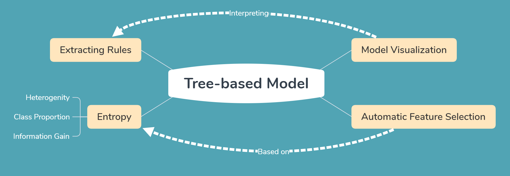

R Studio Instructor Certification
================
Tiara Dwiputri
November 14, 2019

## Topic: Tree-based Machine Learning Model

The course content is prepared as the requirement for R Studio
Instructor Certification Exam. We will go through brief overview of the
concepts revolving around tree-based machine learning model. The
audience of this course can be described as follow:

  - Beginner to intermediate R users
  - Familiar with data analysis and simple statistical analysis practice
  - Exposed to statistical modelling such as linear or logistic
    regression
  - A working professional branching out to a more advance machine
    learning modelling

This content is prepared from a subset of knowledge taught in Data
Science Bootcamp for a quick introductory on tree-based machine learning
model. You are expected to be familiar with R prgoramming language and
are exposed to linear and binomial logistic regression. This course will
also help you to pick up a commonly adopted type of algorithm within
machine learning practice.

## Learner Guide

Please use the slide content stored under `treemodel.html` as your
learner guide.
